---
output:
  html_document: 
    df_print: default
    keep_md: yes
    toc: yes
  pdf_document: 
    latex_engine: xelatex
    number_sections: yes
    toc: yes
---
EDA of Red Wine Data Set by Padmaraj
========================================================


#Abstract: 
#### This tidy data set contains 1,599 red wines with 11 variables on the chemical properties of the wine. At least 3 wine experts rated the quality of each wine, providing a rating between 0 (very bad) and 10 (very excellent).

# Univariate Plots Section
## Plots for 'Alcohol' variable

```
##    Min. 1st Qu.  Median    Mean 3rd Qu.    Max. 
##    8.40    9.50   10.20   10.42   11.10   14.90
```

<!-- -->

####In the Above plot, we could see that there are discontinuity in plots. These are present in both the ends of the graph. Note that here the bandwidth is set to ".1" while plotting which is based on the observation made on "Summary" (table above to the plot) output. The Table indicates that the variable values can have high variance in fractions, especially, 1/10th position.

<!-- -->

####Here we attempted to remove those outliers which were causing the discontinuity in the map. Data points below 1 percentile and above 99 percentile were removed. The limit of the percentile were chosen based on the iterative approach to retain maximum input samples but without outliers.

#### Now, the above plot is not only continuous but also indicates the range of value for the alcohol variable more accurately. The plot indicates one more aspect ,density, for which it was plotted. We see that variable has lot of data points / samples in between 9 - 11 units. Let us zoom in to have the clear visualisation of density variation in the high/upper peak of the above chart.
<!-- -->

#### IQR = 75 percentile - 25 percentile i.e. Data samples lying in second and third quantile. In other words, IQR gives us the center portion (domb) of the normal distribution. Here we see that, though alcohol has range of 9 to 14; maximum data samples have alcohol units ranging between 9.5 to 11.5. Note that IQR values can also be noted in Summary output but the visualization of the same gives us the idea of the frequency of values under IQR.


###Let us do the similar plotting for the rest of the variables for red wine data. 
###1. First we will have the Summary data on the variable
###2. We will then plot the histogram of variable without outlier extraction.
###3. Followed by the same plot but with outlier removed.
###4. Finally IQR plot to visualise the peak density range.
## Plots for 'sulphates' variable

```
##    Min. 1st Qu.  Median    Mean 3rd Qu.    Max. 
##  0.3300  0.5500  0.6200  0.6581  0.7300  2.0000
```

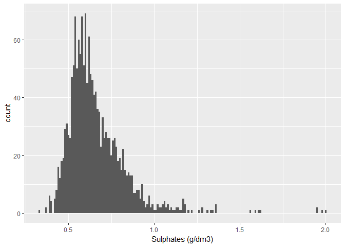<!-- -->

#### Note that here we see that variable value varies at 1/100 th position.
\pagebreak
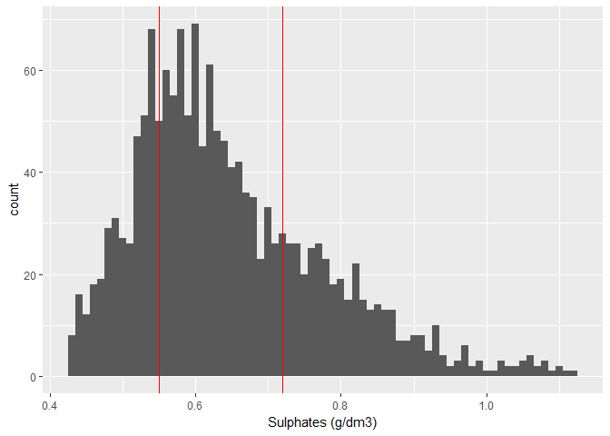

#### Note that we can cut the tail at suphates greater than 1.0. However, I am removing the samples only those which would cause discontinuity for the binwidth = 0.01.

\  
\  
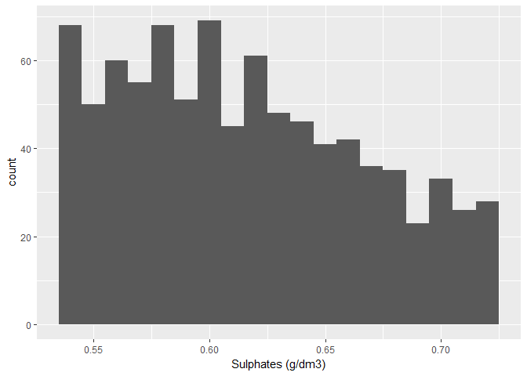<!-- -->

## Plots for 'fixed.acidity' variable

```
##    Min. 1st Qu.  Median    Mean 3rd Qu.    Max. 
##    4.60    7.10    7.90    8.32    9.20   15.90
```

<!-- -->

#### Initial plot with binwidth = 0.1
<!-- -->

#### The above graph is with the outlier removed and indicates the IQR ranges
<!-- -->

####Graph with data points in IQR.
## Plots for 'volatile.acidity' variable

```
##    Min. 1st Qu.  Median    Mean 3rd Qu.    Max. 
##  0.1200  0.3900  0.5200  0.5278  0.6400  1.5800
```

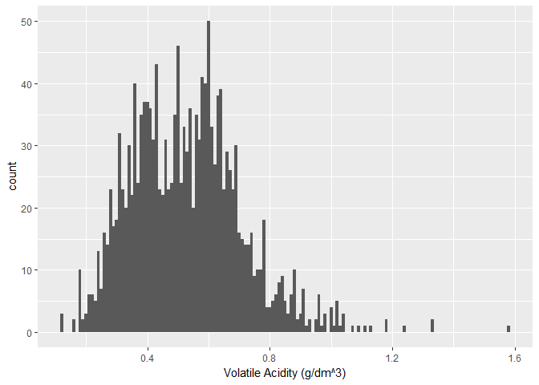<!-- -->

#### Initial plot with binwidth = 0.01
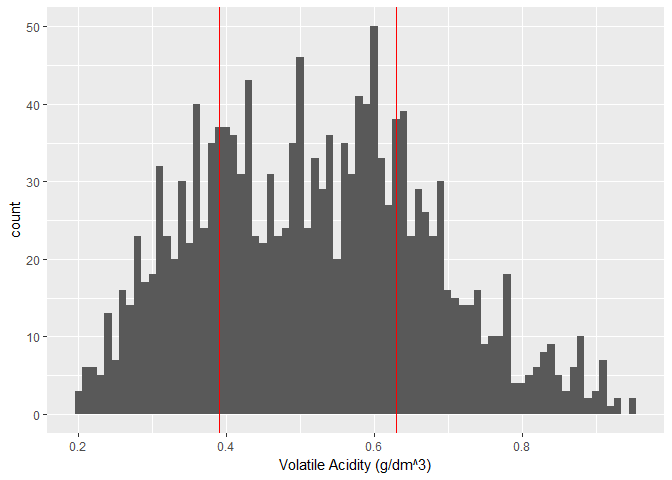<!-- -->

#### The above graph is with the outlier removed and indicates the IQR ranges
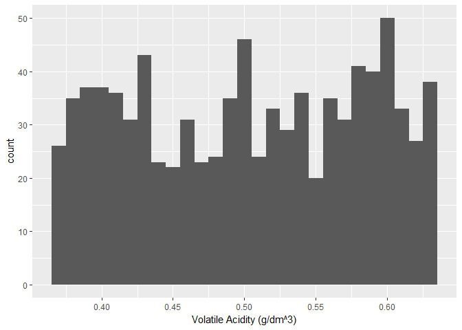<!-- -->

####Graph with data points in IQR.
##Plots for 'citric.acid' variable

```
##    Min. 1st Qu.  Median    Mean 3rd Qu.    Max. 
##   0.000   0.090   0.260   0.271   0.420   1.000
```

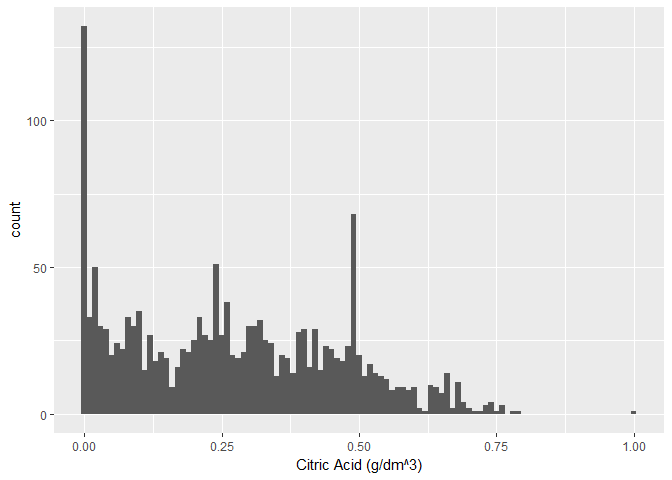<!-- -->

#### Initial plot with binwidth = 0.01
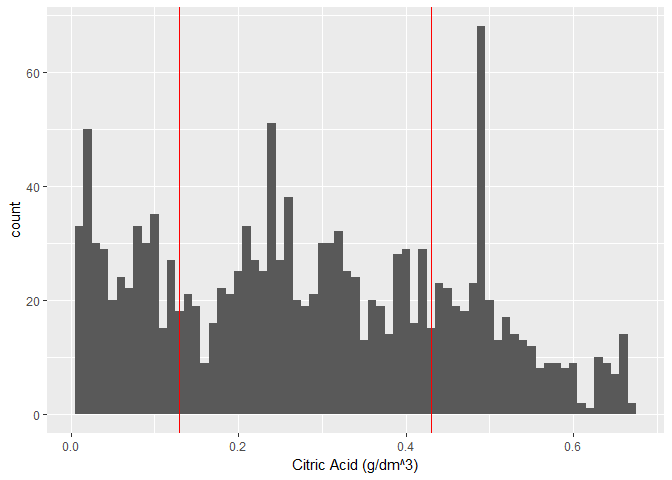<!-- -->

#### The above graph is with the outlier removed and indicates the IQR ranges
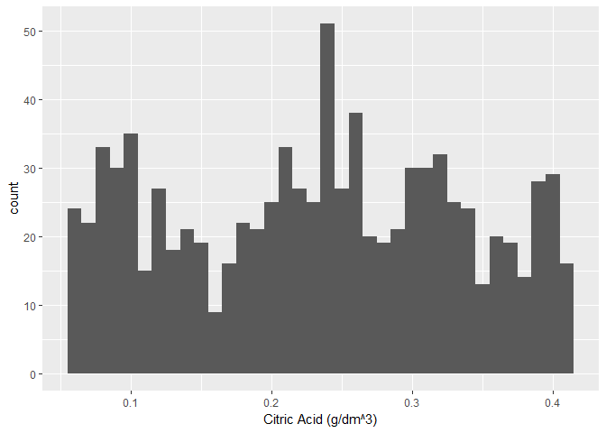<!-- -->

####Graph with data points in IQR.
## Plots for 'residual.sugar' variable

```
##    Min. 1st Qu.  Median    Mean 3rd Qu.    Max. 
##   0.900   1.900   2.200   2.539   2.600  15.500
```

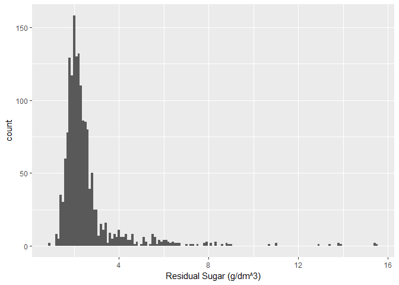<!-- -->

#### Initial plot with binwidth = 0.1
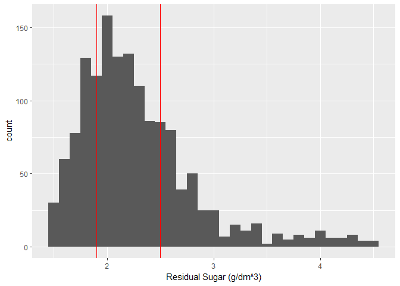<!-- -->

#### The above graph is with the outlier removed and indicates the IQR ranges
<!-- -->

####Graph with data points in IQR.
##Plots for 'chlorides' variable

```
##    Min. 1st Qu.  Median    Mean 3rd Qu.    Max. 
## 0.01200 0.07000 0.07900 0.08747 0.09000 0.61100
```

<!-- -->

#### Initial plot with binwidth = 0.001
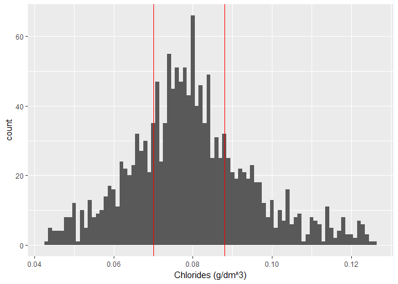<!-- -->

#### The above graph is with the outlier removed and indicates the IQR ranges
<!-- -->

####Graph with data points in IQR.
##Plots for 'free.sulfur.dioxode' variable

```
##    Min. 1st Qu.  Median    Mean 3rd Qu.    Max. 
##    1.00    7.00   14.00   15.87   21.00   72.00
```

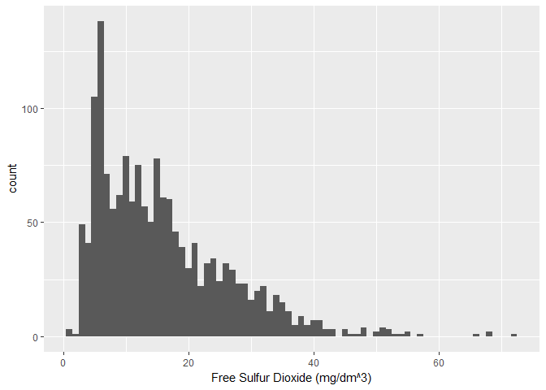<!-- -->

#### Initial plot with binwidth = 1
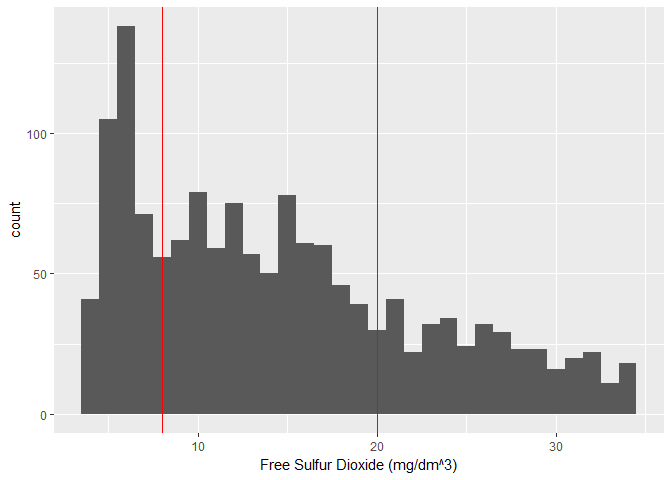<!-- -->

#### The above graph is with the outlier removed and indicates the IQR ranges
<!-- -->

####Graph with data points in IQR.
##Analysis on 'total.sulfur.dioxide' variable

```
##    Min. 1st Qu.  Median    Mean 3rd Qu.    Max. 
##    6.00   22.00   38.00   46.47   62.00  289.00
```

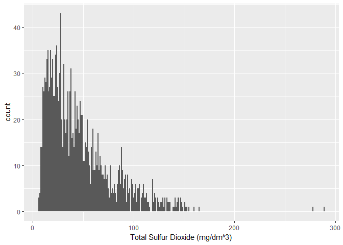<!-- -->

#### Initial plot with binwidth = 1
<!-- -->

#### The above graph is with the outlier removed and indicates the IQR ranges
<!-- -->

####Graph with data points in IQR.
##Plots for 'density' variable

```
##    Min. 1st Qu.  Median    Mean 3rd Qu.    Max. 
##  0.9901  0.9956  0.9968  0.9967  0.9978  1.0037
```

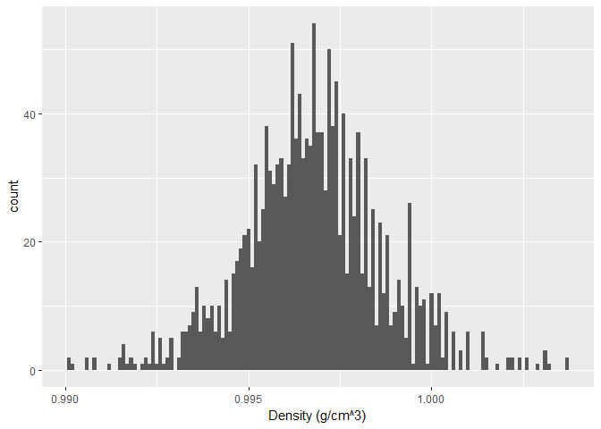<!-- -->

#### Initial plot with binwidth = .0001
<!-- -->

#### The above graph is with the outlier removed and indicates the IQR ranges
<!-- -->

####Graph with data points in IQR.
##Plots for 'pH' variable

```
##    Min. 1st Qu.  Median    Mean 3rd Qu.    Max. 
##   2.740   3.210   3.310   3.311   3.400   4.010
```

<!-- -->

#### Initial plot with binwidth = 0.01
<!-- -->

#### The above graph is with the outlier removed and indicates the IQR ranges
<!-- -->

####Graph with data points in IQR.
##Plots for feature of interest - 'quality' variable

```
##    Min. 1st Qu.  Median    Mean 3rd Qu.    Max. 
##   3.000   5.000   6.000   5.636   6.000   8.000
```

<!-- -->

####Clearly we can see that samples are too low for very good and very bad quality red wine. This may cause the model generated out of it to be biased to predict always the average quality of red wine. 

#### Let us now see the standard deviation of each variable. Note that for comparision between 2 variables we must be normalize the variables. MinMax scaling technique has been used to re-scale the variables between 0-1.

```
##        fixed.acidity     volatile.acidity          citric.acid 
##           0.15407932           0.12264363           0.19480114 
##       residual.sugar            chlorides  free.sulfur.dioxide 
##           0.09657042           0.07857313           0.14732615 
## total.sulfur.dioxide              density                   pH 
##           0.11623790           0.13857077           0.12156415 
##            sulphates              alcohol 
##           0.10150119           0.16394886
```
#### Initial plot with binwidth = .5 for clear seperation of unique values for the variable.

# Univariate Analysis

### What is the structure of your dataset?
#####The Dataset has 13 variables; out of which first one is just the serial number and can be omitted. There are no categorical variables. However, quality can be viewed as both categorical or continuous numerical values.

### What is/are the main feature(s) of interest in your dataset?
#####Main feature of interest is 'quality'. The task is to identify the right combination available variables to come up with the formula to have the higher quality certificate from the expert's review.

### What other features in the dataset do you think will help support your \
investigation into your feature(s) of interest?

####Following  are the top 5 variables with high value of standard deviation:
####1. Citric Acid
####2. Alcohol
####3. fixed.acidity
####4. free.sulfur.dioxide
####5. density

#### My view is that if the variables show high standard deviation then the variable show different value range for different classes for feature of interest.

### Did you create any new variables from existing variables in the dataset?
#####No. There were no new variables created.

### Of the features you investigated, were there any unusual distributions? \
Did you perform any operations on the data to tidy, adjust, or change the form \
of the data? If so, why did you do this?
#####I have changed the type of 'quality' variable to factor. There are 2 reasons for the same. One is to be able to use as categorial variable to identify the impact of other variables on it through the use of facet_wrap function.

#####The other reason is to clearly be able to draw boxplot. Boxplot allows not only to scope of the variable values but also the marks the mean of variable values which help in comparing with other categorical values.

#####I have also transformed data through minmax scaler to compare the 2 variable's standard deviations.

# Bivariate Plots Section
#### In the below Density plots, variables indicates positive or negative influence of on the 'quality' variables. Let us first plot the those variables which we have shortlisted in the univariate analysis. Let us confirm if those variables indeed makes the impact to the feature of interest.


####1. Citric.acid vs quality plot
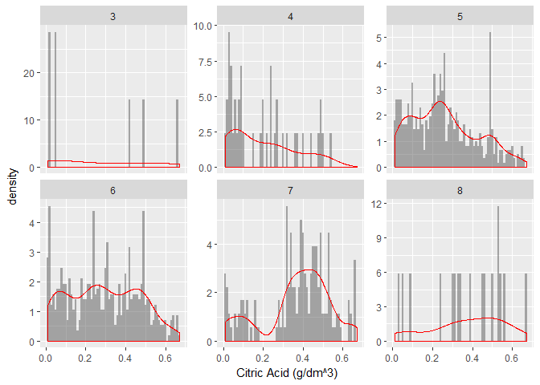<!-- -->

####Here we clearly see the density curve pointing higher values of citric.acid value for higher quality.Note that, current plotting leverages the same ranges used to remove outliers in case of univariate analysis.

####2. alcohol vs quality plot
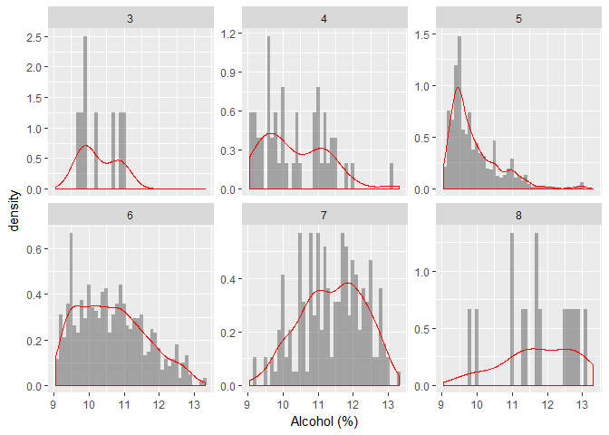<!-- -->

####Again, density curve pointing higher values of acohol units for higher quality can be easily observed.

####3. fixed.acidity vs quality plot
<!-- -->


####4. free.sulfur.dioxide vs quality plot
<!-- -->

####Unlike expected we do not see the density varying for different quality. 
####5. density vs quality plot
<!-- -->

####Again, Unlike expected, we do not see the density varying for different quality. Though there is variation in frequency but the peak density remains at the center.

#### Let us see co relation between the variables and identify the variables impacting feature of interest. fixed.acidity, free.sulfur.dioxide and density did not show expected density curve, so let us start with identifying alternatives for these variables by looking at the co relation with other variables.
<!-- -->

#### Above correlation map between the variables gives valueable hint about the variable influencing the feature of interest variable.

#### The idea is that we would include both variables which are highly correlated either positive or negative. We choose one of them which makes the positive impact on the feature of interest.

#### In the correlation table, identify a column or a row with high number variance. fixed.acidity (row) in the above table has 3 of the variable highly correlated with it. In other words this variable can substitue those 3 variables (citric.acid, density & pH). No let us is there any variable transitively correlated to fixed.acidity variable. Note that we refer correlation value of 0.5 or greater as "high correlation".

#### 1. fixed.acidity has high correlation to citric.acid. Citric.acid has high correlation to pH. So fixed acidity can replace pH variable. However, we had already shortlisted pH as it has direct correlation as well with fixed.acidity. We have volatile.acidity having high correlation with citric.acidity. so fixed.acidity can replace volatile.acidity too.

#### 2. fixed.acidity has high correlation to density. However, density has no high correlation to anyother variable. Note that the graph indicate 0.5 value for the correlation between density and alcohol but it is a rounded value and hence even the plot did not color it as high.

#### 3. fixed.acidity --> pH --> citric.acid is already discussed in point #1

#### That leaves following as the independent contibutor to feature of interest
#### 1. fixed.acidity
#### 2. residual.sugar
#### 3. chlorides
#### 4. free/total.sufur.dioxide [we need to choose one but how ?]
#### 5. sulphates
#### 6. alcohol

#### We have cut down from 11 variable to 6 variables contributing to feature of interest. Note that free.sulfur.dioxide and total.sulfur.dioxide have high correlation between them. I have chosen free.sulfur.dioxide over total.sulfur.dioxide because former has the hight standard deviation.

#### Let us check the impact of outlier removal on the correlation analysis that we have done above


```
##        X          fixed.acidity   volatile.acidity  citric.acid   
##  Min.   :   1.0   Min.   : 4.60   Min.   :0.1200   Min.   :0.000  
##  1st Qu.: 400.5   1st Qu.: 7.10   1st Qu.:0.3900   1st Qu.:0.090  
##  Median : 800.0   Median : 7.90   Median :0.5200   Median :0.260  
##  Mean   : 800.0   Mean   : 8.32   Mean   :0.5278   Mean   :0.271  
##  3rd Qu.:1199.5   3rd Qu.: 9.20   3rd Qu.:0.6400   3rd Qu.:0.420  
##  Max.   :1599.0   Max.   :15.90   Max.   :1.5800   Max.   :1.000  
##  residual.sugar     chlorides       free.sulfur.dioxide
##  Min.   : 0.900   Min.   :0.01200   Min.   : 1.00      
##  1st Qu.: 1.900   1st Qu.:0.07000   1st Qu.: 7.00      
##  Median : 2.200   Median :0.07900   Median :14.00      
##  Mean   : 2.539   Mean   :0.08747   Mean   :15.87      
##  3rd Qu.: 2.600   3rd Qu.:0.09000   3rd Qu.:21.00      
##  Max.   :15.500   Max.   :0.61100   Max.   :72.00      
##  total.sulfur.dioxide    density             pH          sulphates     
##  Min.   :  6.00       Min.   :0.9901   Min.   :2.740   Min.   :0.3300  
##  1st Qu.: 22.00       1st Qu.:0.9956   1st Qu.:3.210   1st Qu.:0.5500  
##  Median : 38.00       Median :0.9968   Median :3.310   Median :0.6200  
##  Mean   : 46.47       Mean   :0.9967   Mean   :3.311   Mean   :0.6581  
##  3rd Qu.: 62.00       3rd Qu.:0.9978   3rd Qu.:3.400   3rd Qu.:0.7300  
##  Max.   :289.00       Max.   :1.0037   Max.   :4.010   Max.   :2.0000  
##     alcohol         quality     
##  Min.   : 8.40   Min.   :3.000  
##  1st Qu.: 9.50   1st Qu.:5.000  
##  Median :10.20   Median :6.000  
##  Mean   :10.42   Mean   :5.636  
##  3rd Qu.:11.10   3rd Qu.:6.000  
##  Max.   :14.90   Max.   :8.000
```

<!-- -->

####Outlier removal did impact the values of the correlation values between the variables. Sulphates now do not have correlation between dioxides and chlorides. Correlation between fixed.acidity and citric.acid , fixed.acidity density and citric.acid and ph have got diluted a bit. However, total.sulfur.dioxide and free.sulfur.dioxide still show comparitively high correlation value.

####Now with the inclusion of the quality variable in the correlation table, it is far easy to understand the impact dependent variable on the independent variable. Earlier, we had created list of variables without considering the impact on feature of interest. It was based on correlation between independent variables. Below are the llst of variable sorted based on high correlation value with feature of interest :
####1. Alcohol
####2. sulphates
####3. citric.acid
####4. fixed.acidity
####5. residual.sugar

####Let us have couple of plot on high and low correlation values from the above plot.
####Low Corelation with outlier :
<!-- -->

##### Correlation between residual.sugar and quality is zero. It can be seen from the above plot that increase in sugar value did not change quality. In other words, all quality varieties have varied residual.sugar.


####Low Corelation without outlier:
<!-- -->

##### Outliers are shifted to median value. Hence, we see dense jitter plots at center of the plot.


#### Let us see the residual.sugar density variations for different quality values.

```
##    Min. 1st Qu.  Median    Mean 3rd Qu.    Max. 
##   0.900   1.900   2.200   2.539   2.600  15.500
```

<!-- -->


#### High Correlation with Outliers:
<!-- -->

#### Note that here correlation is 0.7

#### High Correlation without Outliers:
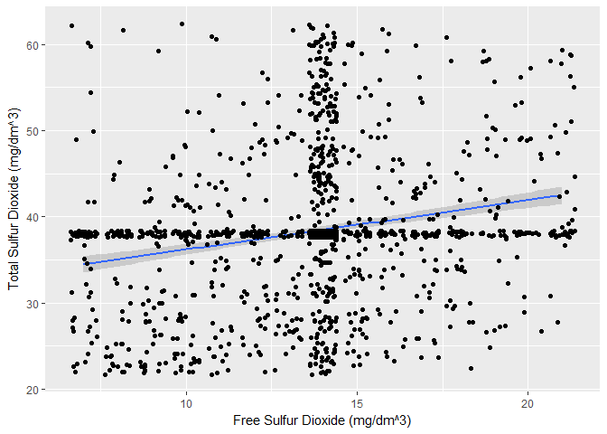<!-- -->

#### Note that here correlation is 0.2. We have a cross mark formed in the graph due to outlier being mapped to median value.

# Bivariate Analysis

### Talk about some of the relationships you observed in this part of the \
investigation. How did the feature(s) of interest vary with other features in \
the dataset?

#####In the univariate analysis we had shortlisted the variables highly impacting the feature of interest. However, correlation analysis between the independent variables and dependent variables indicates high standard deviation might no indicate high correlation with the feature of interest.

### Did you observe any interesting relationships between the other features \
(not the main feature(s) of interest)?

#####residual.sugar indicates no correlation to feature of interest. Boxplot indicates that range has higher limit set for 2.5 for all the quality variable values. And mean is same for all the different quality variable values.

### What was the strongest relationship you found?
#####Strongest relation was found between the two dioxides (correlation value = 0.8).

# Multivariate Plots Section
#### In the previous section we had sorted the variables based on their correlation to feature of interest. Let us see now the correlation between them for differnt quality

#### alcohol vs sulphate with outlier
<!-- -->

#### alcohol vs sulphaes without outlier
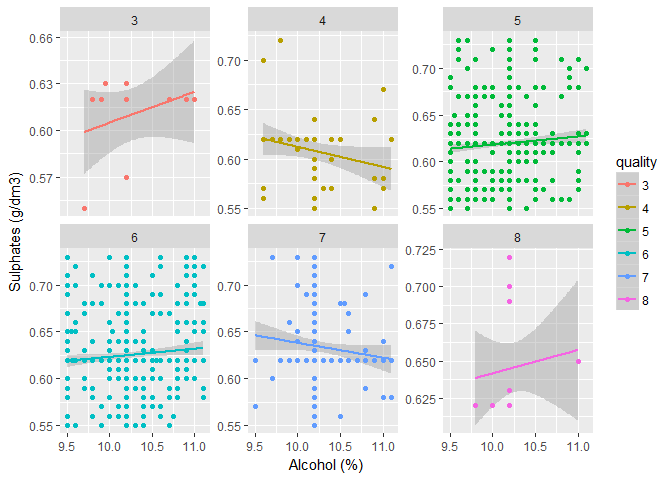<!-- -->

#### The above plot observation matches with correlation table. As the variable has very low correation; changes in one variable has no impact on the other. For various alcohol values the above plot indicates value around 0.65 for sulphates for samples with or without outlier. Note that corelation between alcohol and sulphates are same for with or without outlier samples.

#### fixed.acidity vs citric.acid with outlier
<!-- -->

#### Note that citric acid and fixed acidity has positive correlation between them. Moreover, both of them have positive correlation with quality. Hence we see that those two adds up to the quality in all cases.

#### fixed.acidity vs citric.acid without outlier
<!-- -->

#### With outlier shifted to median we have slight variation in the correlation line plot. However, still we see positive impact of both variables in most of the quality values.

#### As a last plot let us now see the all the 4 variables in a line chart showing its impact on quality.
<!-- -->

# Multivariate Analysis

### Talk about some of the relationships you observed in this part of the \
investigation. Were there features that strengthened each other in terms of \
looking at your feature(s) of interest?

#####Data set variables which have positive correlation to quality were shortlisted in the previous section. In this section plots were carried out to see combined effect of couple of those variables on quality variable.

### Were there any interesting or surprising interactions between features?

#####fixed acidity and citric acid have positive correlation and fixed acidity shows high variance when compared to citric acidity. Hence we may opt to model with only alcohol, sulphates and citric acid from the data set to predict the  quality variable.

### OPTIONAL: Did you create any models with your dataset? Discuss the \
strengths and limitations of your model.

#####I wrote a python program to build a decision tree regression model. The model has very low accuray(28-30%). The model feature_importances_ also gave similar conclusion as that of above in regards to the variables impacting the quality.

------

# Final Plots and Summary

### Plot One
<!-- -->


### Description One
#####Residual sugar has the farthest outlier. Ratio of Max value to the median is highest(7.7) when compared with other variable. Co incidentally, the variable has no correlation with feature of interest even with the outlier removed.

### Plot Two
<!-- -->


### Description Two
#####Alcohol has the highest correlation with quality.0.19 with outlier removed. Making it the most favourable variable for modelling.

### Plot Three

<!-- -->

### Description Three

#####Here the comparison of the impact of top 4 influential variables on quality can be seen. This also suggests that citric acid can be better over fixed acidity as citric acid shows linear correlation with quality.

------

# Reflection

####The intension of the EDA on red wine data set was to check if it can be used to model for a quality prediction.

####There are 11 variables but still as most of them are co related with each other,the only few are useful for modelling.

####Even if we have 1599 observations, the observations are not uniformly distributed with respect to quality. As we have very less observation relating high quality red wines very fine quality wines might be classified as outlier in our model.

####Need more quality (different variables) and quantity (homogeneous mixture of "quality" variables.) to build a model to predict quality of the red wine.
